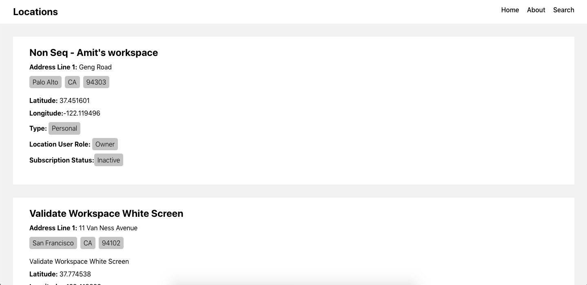
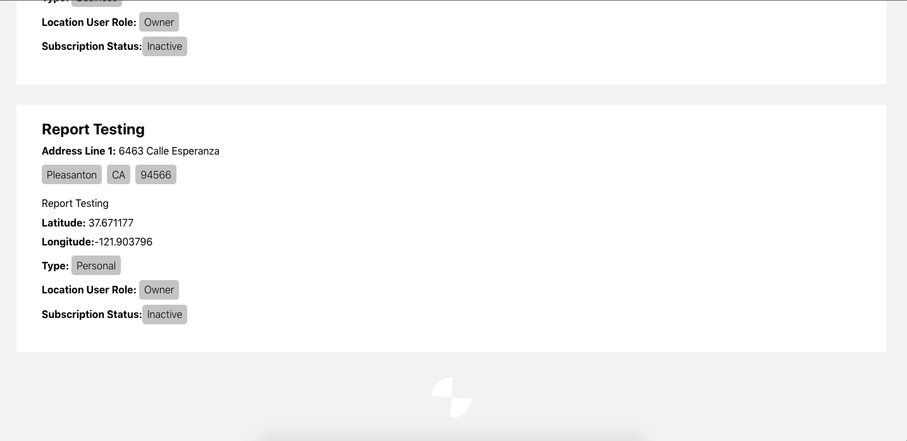

# Locations Loader

)

## Available Scripts

In the project directory, you can run:

### `yarn start`

Runs the app in the development mode.\

### `yarn test`

Launches the test runner in the interactive watch mode.\

### `yarn build`

Builds the app for production to the `build` folder.\
It correctly bundles React in production mode and optimizes the build for the best performance.
